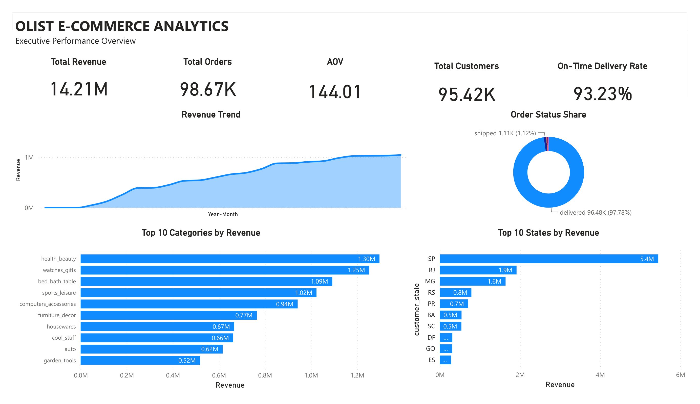
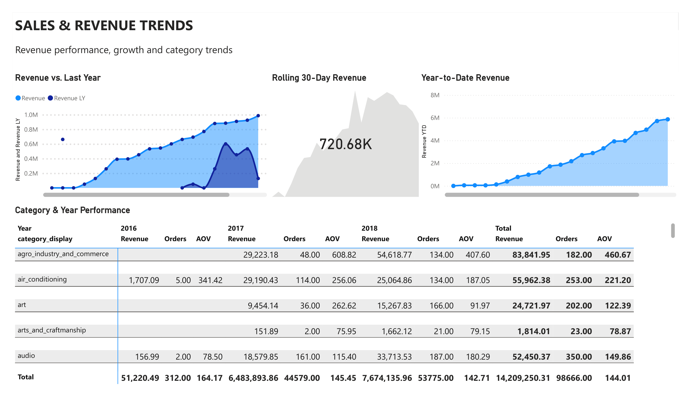
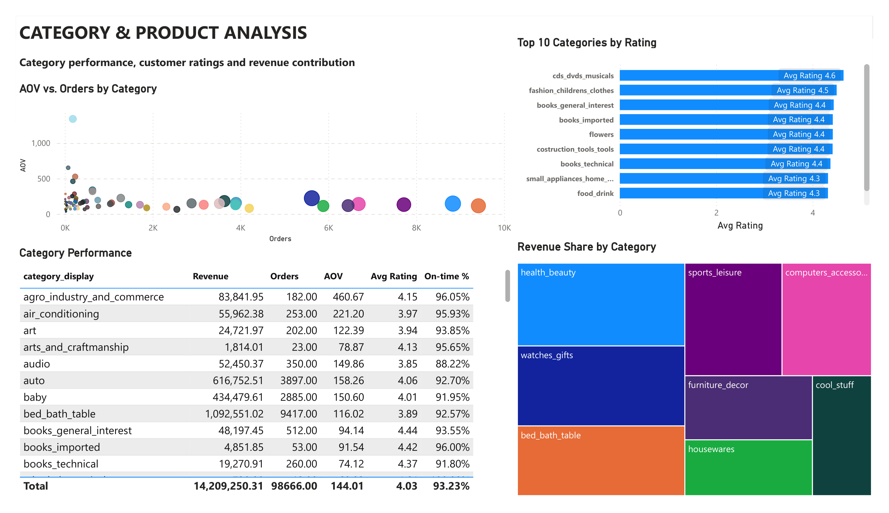

# Olist E-Commerce Analytics Dashboard

An end-to-end BI project built on Olist's real-world Brazilian e-commerce data: 98,666 orders and R$14.2M in revenue, modeled from raw relational tables into a PostgreSQL star schema and served live to Power BI via DirectQuery. The 9-page report covers revenue trends, category and product performance, customer geography, delivery logistics, review sentiment, payments, and seller analytics — driven by custom DAX measures (YoY growth, rolling 30-day revenue, on-time delivery rate, review sentiment split) and a category-level drillthrough page.

## Dataset

[Brazilian E-Commerce Public Dataset by Olist](https://www.kaggle.com/datasets/olistbr/brazilian-ecommerce) — Kaggle, published by Olist. Real, anonymized order data (2016–2018) covering ~100K orders across multiple relational tables (orders, order items, products, customers, sellers, payments, reviews, geolocation).

The raw CSVs were loaded into PostgreSQL and modeled into a star schema (fact table + date dimension) before being connected to Power BI via DirectQuery.

## Preview

See the full page-by-page walkthrough below, or view the [full PDF export](https://github.com/devesh1264/olist-ecommerce-analytics-dashboard/blob/main/olist-ecommerce-analytics-dashboard.pdf) for all 9 pages at once.

**[Download the .pbix](https://github.com/devesh1264/olist-ecommerce-analytics-dashboard/raw/main/olist-ecommerce-analytics-dashboard.pbix)** to open the live report in Power BI Desktop.

## Dashboard Pages

| Page | Screenshot | What it covers |
|---|---|---|
| Overview (Executive Dashboard) | `olist-ecommerce-analytics-dashboard-1.png` | Total revenue, orders, customers, AOV, on-time delivery rate, revenue trend, top categories, order status split, top states by revenue |
| Sales Trends | `olist-ecommerce-analytics-dashboard-2.png` | Revenue vs. last year, rolling 30-day revenue, YTD revenue, category × year performance |
| Category & Product Analysis | `olist-ecommerce-analytics-dashboard-3.png` | AOV vs. orders by category, top categories by rating, revenue share by category, full category performance table |
| Customer Geography | `olist-ecommerce-analytics-dashboard-4.png` | Top states/cities by revenue, state × category performance |
| Delivery & Logistics | `olist-ecommerce-analytics-dashboard-5.png` | Late orders, on-time delivery rate, delivery days by category, late order rate by state |
| Customer Reviews & Ratings | `olist-ecommerce-analytics-dashboard-6.png` | Average rating, positive/negative review %, rating distribution, rating by on-time vs. late delivery, rating by category |
| Payment Analysis | `olist-ecommerce-analytics-dashboard-7.png` | Payment method distribution, average installments, payment value trend, payment summary |
| Seller Performance | `olist-ecommerce-analytics-dashboard-8.png` | Total sellers, revenue per seller, top sellers, revenue by seller state, seller × category performance |
| Drillthrough (Category Details) | `olist-ecommerce-analytics-dashboard-9.png` | Right-click drillthrough from any category to a dedicated detail page — revenue trend by year, customer state breakdown, and KPI cards scoped to that category |

## Key Metrics

- **Total Revenue:** R$14.21M across 98.67K orders
- **AOV:** R$144.01
- **On-Time Delivery Rate:** 93.23%
- **Average Review Rating:** 4.03 / 5 (77.56% positive, 14.19% negative, 8.25% neutral)

## Techniques Used

- **DirectQuery** against PostgreSQL — no data duplication, always-live model
- **DAX measures**: rolling 30-day revenue, year-over-year comparison, AOV, on-time/late delivery rate, positive/negative review %, revenue-per-seller
- **Calculated column** to handle nulls in the category field for accurate downstream aggregation
- **Drillthrough** page bound to category, with a custom back-navigation button
- Cross-visual filtering, bookmarks-free navigation via page tabs

## Files

- [`olist-ecommerce-analytics-dashboard.pbix`](https://github.com/devesh1264/olist-ecommerce-analytics-dashboard/raw/main/olist-ecommerce-analytics-dashboard.pbix) — the Power BI report (open in Power BI Desktop; DirectQuery connection details will need to point at your own PostgreSQL instance)
- [`olist-ecommerce-analytics-dashboard.pdf`](https://github.com/devesh1264/olist-ecommerce-analytics-dashboard/blob/main/olist-ecommerce-analytics-dashboard.pdf) — full page-by-page PDF export of the report
- `olist-ecommerce-analytics-dashboard-1.png` through `-9.png` — individual page screenshots, in dashboard order (see table above)

## Setup

1. Restore the Olist CSVs into a PostgreSQL database.
2. Open `olist-ecommerce-analytics-dashboard.pbix` in Power BI Desktop.
3. Update the DirectQuery connection (Transform Data → Data Source Settings) to point at your PostgreSQL instance.
4. Refresh.

## Author

Devesh Rathod
